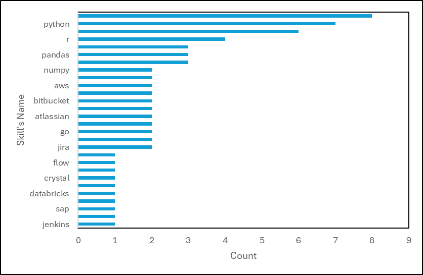

# Introduction 
This project serves as the capstone for my SQL journey. The project outlines the data job market and explores 💰 top-paying jobs, 🔥 in-demand skills, and 📈 where high demand meets high salary in data analytics.
🔍 SQL queries? Check them out here: [project_sql folder](/project_sql/)
# Background
This project is the culmination of my SQL learning journey with Luke Barousse, an exceptional educator who provided the data and guidance necessary to bring this project to life. 
I highly recommend exploring his work [here](https://www.youtube.com/watch?v=7mz73uXD9DA&t=3224s). His instructional content is freely accessible on YouTube, making it an invaluable resource for anyone looking to learn SQL. 
## The questions I wanted to answer through my SQL queries were:
1. What are the top-paying data analyst jobs?
2. What skills are required for these top-paying jobs?
3. What skills are most in demanded for data nalaysts?
4. What skills are most in demand for data analysts who wants to work remotely and the expected average salary?
# Tools used
For my deep dive into the data analyst job market, I harnessed the power of several key tools:
- **SQL:** The backbone of my analysis, allowing me to query the database and unearth critical insights.
- **PostgreSQL:** The chosen database management system, ideal for handling the job posting data.
- **Visual Studio Code:** My go-to for database management and executing SQL queries.
- **Git & GitHub:** Essential for version control and sharing my SQL scripts and analysis, ensuring collaboration and project tracking.
# Analysis
### 1. Top Paying Data Analyst Jobs
To identify the highest-paying roles, I filtered data analyst positions by average yearly salary and location, focusing on remote jobs. This query highlights the high paying opportunities in the field.
```sql
SELECT 
    job_id, 
    job_title,
    job_location,
    job_schedule_type,
    salary_year_avg,
    job_posted_date,
    company_dim.name AS company_name
FROM 
    job_postings_fact INNER JOIN company_dim ON job_postings_fact.company_id = company_dim.company_id
WHERE 
    salary_year_avg IS NOT NULL AND
    job_location = 'Anywhere' AND 
    job_title_short = 'Data Analyst'
ORDER BY salary_year_avg DESC
LIMIT 10;
```
Here's the breakdown of the top data analyst jobs in 2023:
- **Wide Salary Range:** Top 10 paying data analyst roles span from $184,000 to $650,000, indicating significant salary potential in the field.
- **Diverse Employers:** Companies like SmartAsset, Meta, and AT&T are among those offering high salaries, showing a broad interest across different industries.
- **Job Title Variety:** There's a high diversity in job titles, from Data Analyst to Director of Analytics, reflecting varied roles and specializations within data analytics.

*Bar graph visualizing the salary for the top 10 salaries for data analysts; Graph geneerated by Excel from SQL results*
### 2. Skills for Top Paying Jobs
To understand what skills are required for the top-paying jobs, I joined the job postings with the skills data, providing insights into what employers value for high-compensation roles.
```sql
WITH top_paying_job AS (
    SELECT 
        job_postings_fact.job_id,
        job_title,
        job_schedule_type,
        salary_year_avg,
        company_dim.name AS company_name
    FROM 
        job_postings_fact INNER JOIN company_dim ON job_postings_fact.company_id = company_dim.company_id
    WHERE 
        salary_year_avg IS NOT NULL AND
        job_location = 'Anywhere' AND 
        job_title_short = 'Data Analyst'
    ORDER BY salary_year_avg DESC
    LIMIT 10
)
SELECT 
    top_paying_job.*,
    skills
FROM 
    skills_job_dim INNER JOIN top_paying_job ON skills_job_dim.job_id = top_paying_job.job_id
    INNER JOIN skills_dim ON skills_job_dim.skill_id = skills_dim.skill_id
ORDER BY salary_year_avg DESC
```
Here's the breakdown of the most demanded skills for the top 10 highest paying data analyst jobs in 2023:
- **SQL** is leading with a bold count of 8.
- **Python** follows closely with a bold count of 7.
- **Tableau** is also highly sought after, with a bold count of 6.
Other skills like **R**, **Snowflake**, **Pandas**, and **Excel** show varying degrees of demand.

*Bar graph visualizing the count of skills for the top 10 paying jobs for data analysts; Excel generated this graph from my SQL query results*
### 3. Most In-demand skills overall
This query helped identify the skills most frequently requested in job postings, directing focus to areas with high demand. The data does is inclusive of all data jobs, regardless of working locations.
```sql
WITH job_remote AS (
    SELECT
        skill_id,
        COUNT(*) AS number_of_jobs
    FROM 
        job_postings_fact 
        INNER JOIN skills_job_dim ON job_postings_fact.job_id = skills_job_dim.job_id
    WHERE
        job_work_from_home = True AND
        job_postings_fact.job_title_short = 'Data Analyst'
    GROUP BY skill_id
)
SELECT
    skills_dim.skills,
    number_of_jobs,
    skills_dim.skill_id
FROM 
    skills_dim INNER JOIN job_remote ON skills_dim.skill_id = job_remote.skill_id
ORDER BY number_of_jobs DESC
LIMIT 10;
```
Here's the breakdown of the most demanded skills for data analysts in 2023
- **SQL** and **Excel** remain fundamental, emphasizing the need for strong foundational skills in data processing and spreadsheet manipulation.
- **Programming** and **Visualization Tools** like **Python**, **Tableau**, and **Power BI** are essential, pointing towards the increasing importance of technical skills in data storytelling and decision support.
| Skills   | Sum of Number of Jobs |
|----------|-----------------------|
| SQL      | 7291                  |
| Excel    | 4611                  |
| Python   | 4330                  |
| Tableau  | 3745                  |
| Power BI | 2609                  |
| R        | 2142                  |
| SAS      | 1866                  |
| Looker   | 868                   |
| Azure    | 821                   |
*Table of the demand for the top 5 skills in data analyst job postings*

*Bar graph visualizing the demand of the top 10 skills mentioend in job postings for data analysts; Excel generated this graph from my SQL query results*
### 4. Most In Demand Skills Based on Yearly Salary for Data Analyst
Exploring the average salaries associated with different skills revealed which skills are the highest paying for remote Data Analysts.
```sql
WITH job_remote AS (
    SELECT
        skill_id,
        AVG(job_postings_fact.salary_year_avg) AS Avg_yearly_salary,
        COUNT(*) AS number_of_jobs
    FROM 
        job_postings_fact 
        INNER JOIN skills_job_dim ON job_postings_fact.job_id = skills_job_dim.job_id
    WHERE
        job_work_from_home = True AND
        job_postings_fact.job_title_short = 'Data Analyst'
    GROUP BY skill_id
)
SELECT
    skills_dim.skills,
    number_of_jobs,
    skills_dim.skill_id,
    ROUND(Avg_yearly_salary,2) AS Average_yearly_salary
FROM 
    skills_dim INNER JOIN job_remote ON skills_dim.skill_id = job_remote.skill_id
ORDER BY number_of_jobs DESC;
```

*Bar graph visualizing the ranking of yearly salary offering for different skills against the job postings for each skills; Excel generated this graph from my SQL query results*
The data are 2023 job postings, and it gives valuable insight into the demand and compensation for various technical skills in the job market. Among the most sought-after skills, SQL stands out with the highest number of job openings at 7,291, and an average yearly salary of $97,237.16. This indicates the widespread need for professionals proficient in SQL, particularly in roles related to data management and analysis.
Python, another high-demand skill, has 4,330 job openings with an average salary of $101,397.22. Python's versatility in programming and data analysis, combined with its use in machine learning and automation, makes it a critical skill in the technology sector. Similarly, Tableau and Power BI, tools used for data visualization, show strong demand with 3,745 and 2,609 job openings, and average salaries of $99,287.65 and $97,431.30, respectively. These tools are essential for turning complex data into actionable insights, a necessity for business intelligence and analytics roles.
Advanced programming and cloud-related skills command some of the highest salaries. For instance, the programming language Go, despite having only 815 job openings, offers an impressive average salary of $115,319.89. This high pay reflects its specialized use in building scalable and efficient software systems. Similarly, Azure and AWS, both cloud computing platforms, offer lucrative average salaries of $111,225.10 and $108,317.30, respectively. These platforms are integral to modern IT infrastructure, driving demand for skilled professionals in these areas.
Other notable skills include R, a programming language used for statistical computing and graphics, which has an average salary of $100,498.77 with 2,142 job openings. Looker, a data platform for business intelligence, also commands a high average salary of $103,795.30 despite having only 868 job openings, indicating its value in specialized data roles. Tools like SAS and SPSS, used for advanced analytics and statistical analysis, offer average salaries close to $99,000, reflecting their importance in data-driven decision-making.
On the lower end of the demand spectrum, skills like HTML, VBA, and MongoDB have fewer job openings and comparatively lower average salaries, though they remain essential in their respective niches. For example, MongoDB, a NoSQL database, offers an average salary of $66,019.67, with 91 job openings. In contrast, more specialized skills like GitLab, with just 57 job openings, command a significantly higher average salary of $154,500.00, highlighting the premium placed on expertise in version control systems.
In summary, the data reveals a strong demand for data-related skills, programming languages, and cloud computing expertise, with corresponding salaries that reflect the value these skills bring to the market. Skills in high demand, such as SQL, Python, and cloud platforms, are widely needed across industries, while more specialized skills, though fewer in demand, offer substantial financial rewards.
# Key Findings and Executive Sumamry
From the analysis, several general insights emerged:
1. **Top-Paying Data Analyst Jobs**: The highest-paying jobs for data analysts that allow remote work offer a wide range of salaries, the highest at $650,000!
2. **Skills for Top-Paying Jobs**: High-paying data analyst jobs require advanced proficiency in SQL, suggesting it’s a critical skill for earning a top salary.
3. **Most In-Demand Skills**: SQL is also the most demanded skill in the data analyst job market, thus making it essential for job seekers.
4. **Skills with Higher Salaries**: Specialized skills, such as SVN and Solidity, are associated with the highest average salaries, indicating a premium on niche expertise.
5. **Optimal Skills for Job Market Value**: SQL leads in demand and offers for a high average salary, positioning it as one of the most optimal skills for data analysts to learn to maximize their market value.
# Conclusions
Throughout this journey, I've significantly enhanced my SQL skills, transforming into a more proficient and confident data analyst. By mastering complex query crafting, I've become adept at merging tables and using advanced techniques like WITH clauses to create efficient and powerful temporary tables. My understanding of data aggregation has deepened, enabling me to utilize GROUP BY and aggregate functions such as COUNT() and AVG() to summarize data effectively. These skills have empowered me to solve real-world problems, translating complex questions into actionable and insightful SQL queries.
From my analysis, several key insights have emerged that highlight the value of SQL expertise in the data analyst job market. The highest-paying remote data analyst positions offer impressive salaries, with some reaching as high as $650,000. These top-tier jobs consistently require advanced SQL proficiency, underscoring the importance of SQL as a critical skill for those aiming to secure a high-paying role. Moreover, SQL is the most in-demand skill across the data analyst job market, making it an essential tool for job seekers.
Additionally, specialized skills such as SVN and Solidity are associated with the highest average salaries, indicating that niche expertise commands a premium in the industry. However, SQL remains a foundational skill that not only is in high demand but also offers substantial earning potential. As a result, for data analysts looking to maximize their market value, mastering SQL is one of the most strategic investments they can make in their career development.
## Closing thoughts
Reflecting on this experience, I am deeply grateful for the opportunity to learn these valuable skills free of charge online. A special thank you goes to Luke Barousse and his team for providing these resources at no cost. This project not only sharpened my SQL skills but also offered critical insights into the data analyst job market. The findings from this analysis serve as a practical guide for prioritizing skill development and job search strategies.
For aspiring data analysts, focusing on high-demand and high-salary skills is key to standing out in a competitive market. This exploration underscores the importance of continuous learning and staying adaptable to emerging trends in data analytics. By embracing these principles, data professionals can better navigate the ever-evolving landscape of this field.
